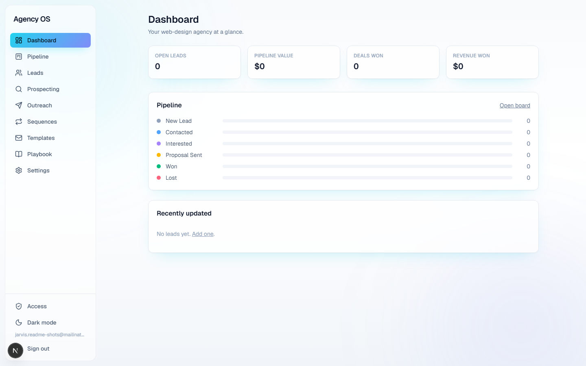
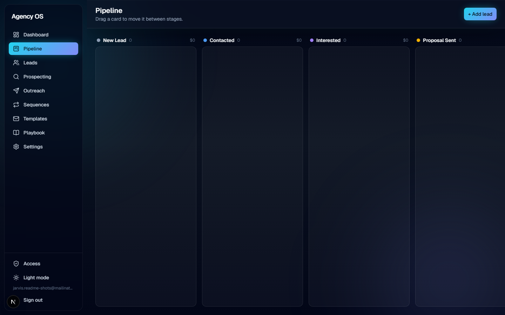
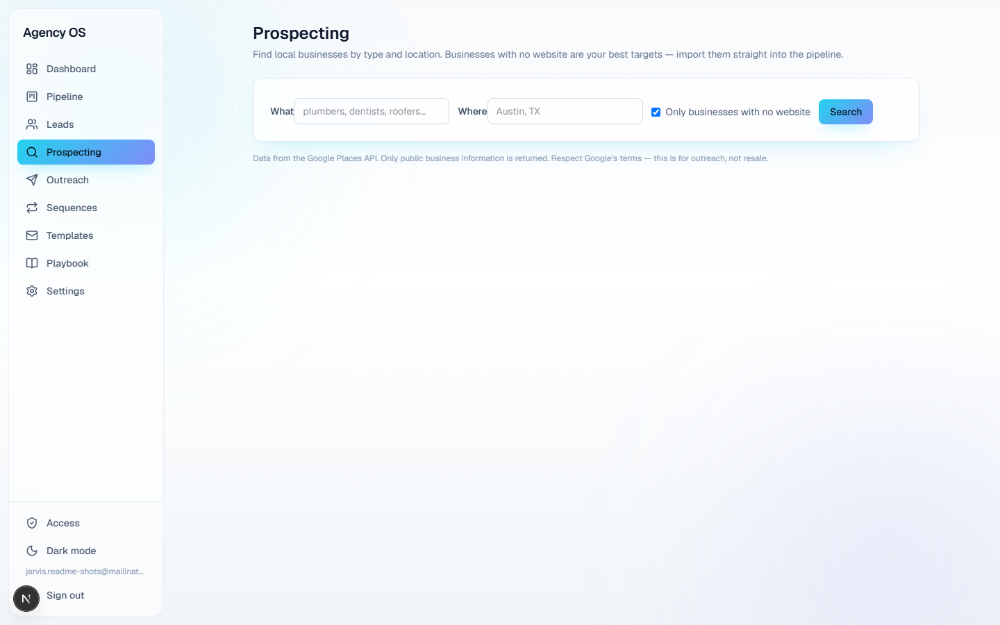
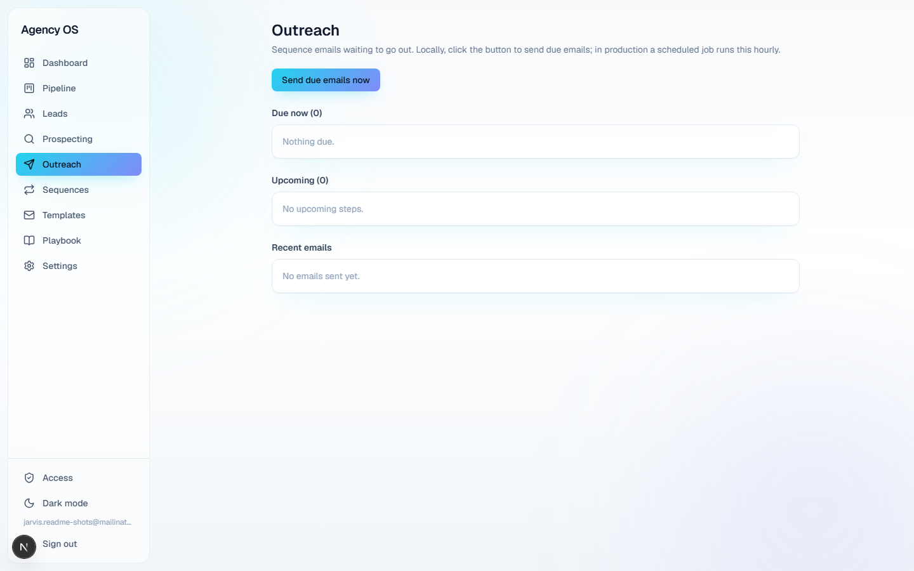
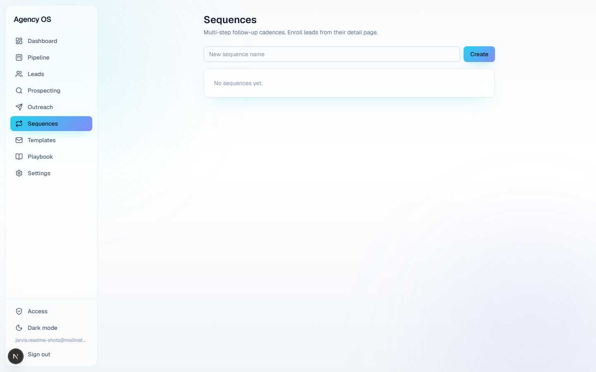
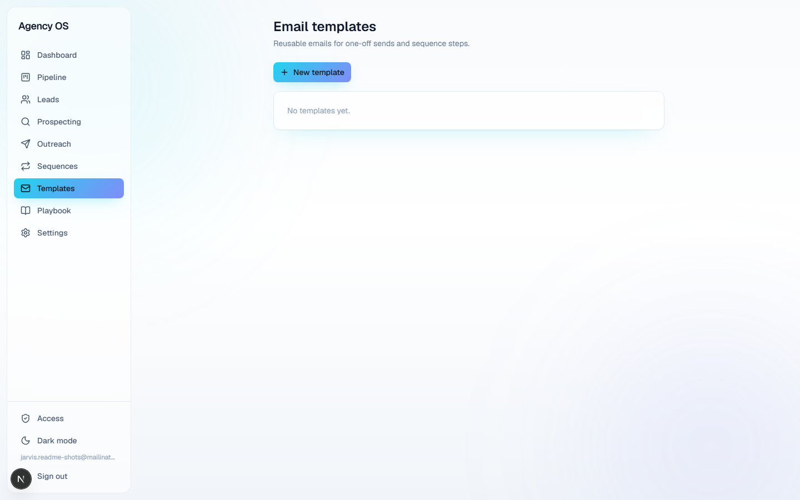
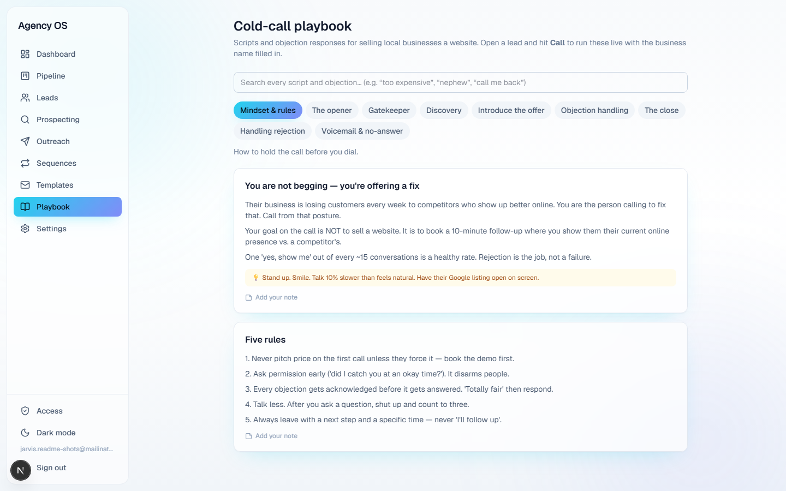
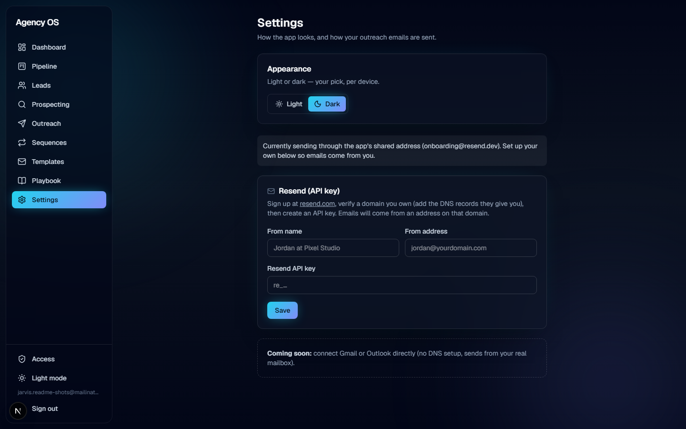
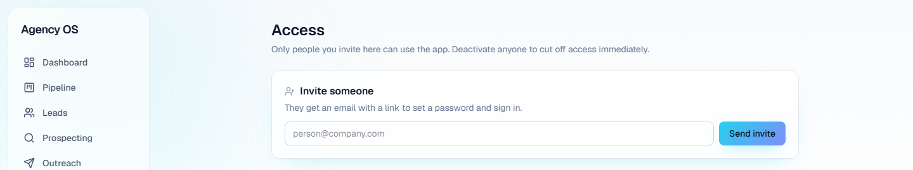

# Agency OS

A self-hosted CRM and prospecting tool built for one workflow: find a local
business with no website, sell them one, and run the whole relationship from
first cold call to closed deal in a single app.

Invite-only. Multiple people can work the same pipeline, each sending
outreach from their own connected email address.



## What it does

- **Pipeline** — a drag-and-drop kanban board (New Lead → Contacted →
  Interested → Proposal Sent → Won / Lost) with a per-lead activity log.
- **Prospecting** — search local businesses by trade and city through the
  Google Places API, filter to only businesses with no website, and bulk
  import straight into the pipeline.
- **Outreach (email)** — templates with merge fields, multi-step sequences
  with day-delays, and an hourly job that sends whatever's due. Each person
  sends from their own Resend-connected address, with a shared fallback
  address for anyone who hasn't set one up yet.
- **Cold-calling playbook** — mindset, opener, gatekeeper, discovery, pitch,
  searchable objection responses, closing, rejection handling, and
  voicemail scripts. "Call Mode" fills in the script live with the
  business's name and details, and one-click outcome logging updates the
  call log, activity feed, pipeline stage, and follow-up date together.
- **Access control** — invite-only signup. Admins invite people by email,
  assign roles, and can deactivate anyone's access instantly.
- **Appearance** — light and dark themes, saved per device.

## Screenshots

| | |
|---|---|
|  |  |
| Pipeline (dark) | Prospecting |
|  |  |
| Outreach | Sequences |
|  |  |
| Templates | Cold-call playbook |
|  |  |
| Settings (dark) | Access (admin) |

## Tech stack

- [Next.js](https://nextjs.org) (App Router, Turbopack) + React + TypeScript
- [Supabase](https://supabase.com) — Postgres, auth, row-level security
- [Resend](https://resend.com) — outbound email
- [Google Places API](https://developers.google.com/maps/documentation/places/web-service) — business search
- Tailwind CSS

## Getting started

1. Clone the repo and install dependencies:
   ```bash
   npm install
   ```
2. Copy `.env.local.example` to `.env.local` and fill in your own Supabase,
   Resend, and Google Places credentials.
3. Run the SQL migrations in `supabase/` against your Supabase project (SQL
   editor, in order — there's no automated migration pipeline).
4. Start the dev server:
   ```bash
   npm run dev
   ```
5. Open [http://localhost:3000](http://localhost:3000). The first account
   needs to be created directly in Supabase Auth and given the `admin` role
   in the `profiles` table — after that, admins can invite everyone else
   from the Access page in-app.

## Deployment

Built for [Vercel](https://vercel.com). Set every variable from
`.env.local.example` as an encrypted environment variable in the Vercel
project — never commit real keys. The hourly outreach-sending job runs via
the Vercel Cron entry already configured in `vercel.json`.
